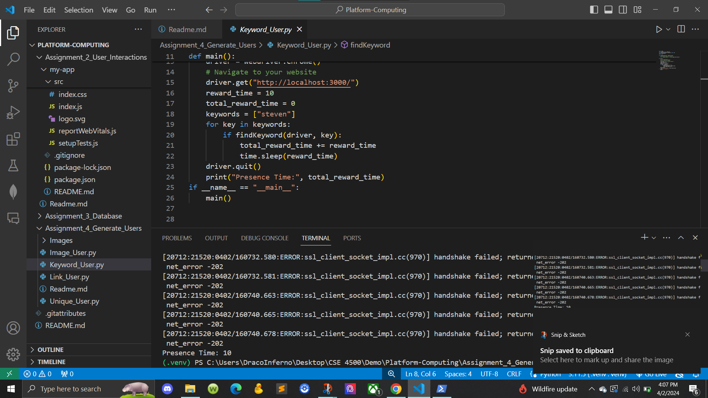
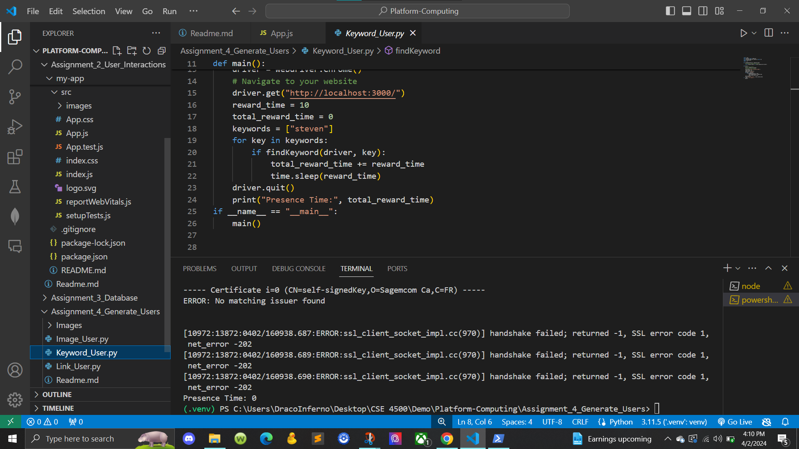
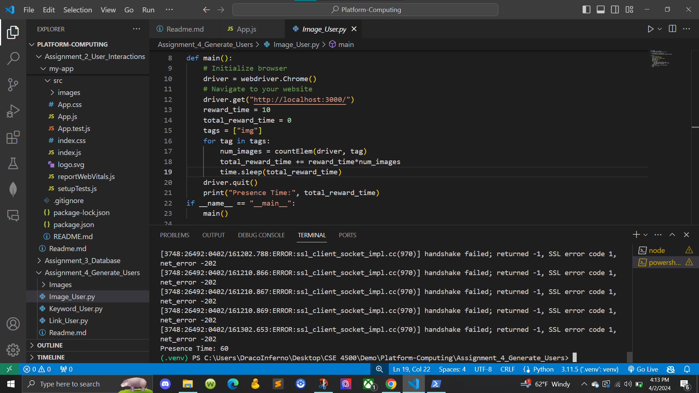
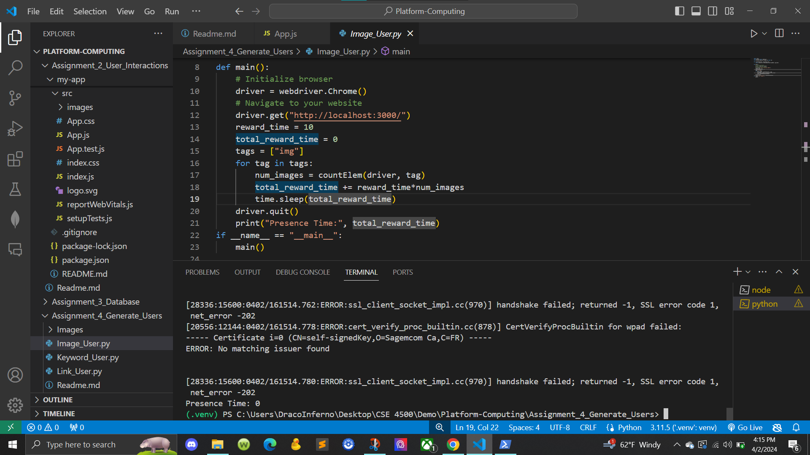
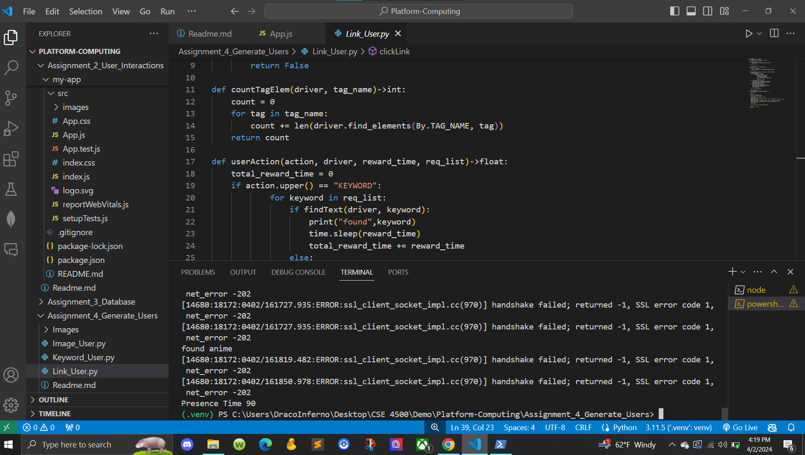
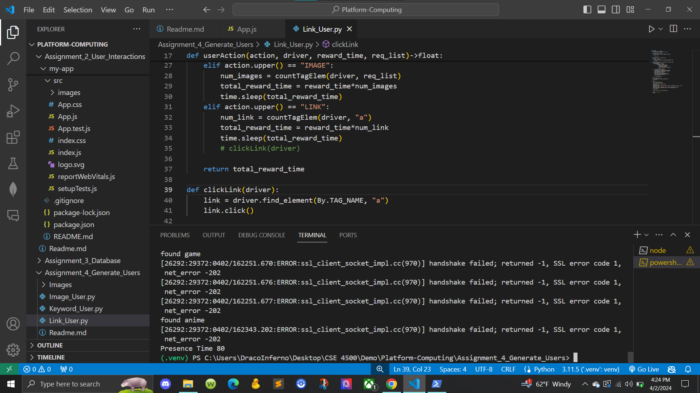
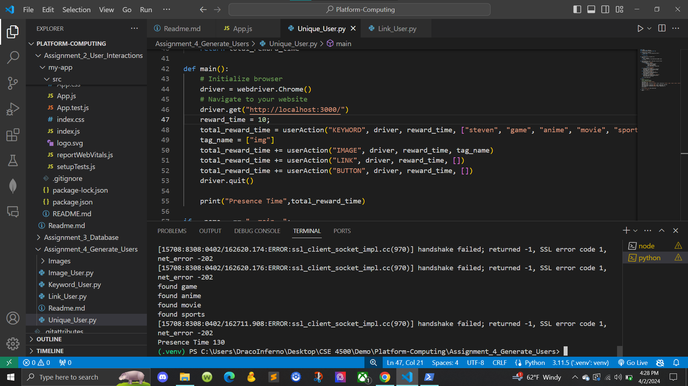

# Generate Users

PROVIDE OVERVIEW OF ASSIGNMENT HERE

Time spent: **6** hours spent in total

## Features

The following **required** features are completed:

- [X] Organize Github folders (2 pts)
- [X] Create a user with affinity towards keyword(s) and verify that it works (3 pts)
- [X] Create a user with affinity towards image(s) and verify that it works (3 pts)
- [X] Create a user with affinity towards links and verify that it works (3 pts)
- [X] Describe a user with unique affinities (1 pt)
- [X] Create a user with unique affinities and verify that it works (3 pts)
The following **bonus** features are implemented:

- [ ] Create a unique user with an affinity OUTSIDE of keywords, images, or links (1.5 pt)
- [ ] Uploaded files for a unique user BOTH in javascript and python (1.5 pt)
- [ ] DESCRIBE ANY OTHER FEATURES HERE.

## Screenshot and/or Video Walkthrough

## Notes:
PROVIDE RELEVANT OR ADDITIONAL INFORMATION HERE. Below are formatting options to add emphasis in text
<ul>
  <li>For keyword_user I made steven a keyword and it counted 10 sec and when I remove they keyword it became 0 sec</li>
  <li>For image_user I have 6 images and it counted 60 sec and when I remove or commented them out it became 0 sec</li>
  <li>For link_user I had a link that made it 90 becuase it has the function of 2 keyword and 6 images with the 1 link and without it that total would be 80 sec </li>
  <li>For Unique_user I had with the keywords, images, links, and button that total of 130 second</li>
</ul>
